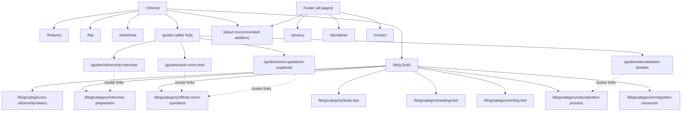

# nextCitizen Content & SEO Strategy

**Company:** SanAkLabs
**Product:** nextCitizen
**Document status:** Single source of truth for content, SEO, and information architecture decisions
**Scope:** nextcitizen-website only (no source code, components, styles, or configuration are changed by this document)

---

# Executive Summary

nextCitizen is entering a category with several entrenched citizenship-test apps and government/nonprofit resources (USCIS.gov itself, established quiz apps, and community org PDFs). We will not out-market them. We will out-help them.

The strategy is simple to state and hard to execute: **become the single most useful, most trustworthy explanation of the U.S. citizenship process on the internet**, structured so that every page earns its own search traffic, and every page has a short, honest, low-pressure path to the Android app. Growth comes from search intent coverage and topical authority (pillar pages + supporting clusters), not from volume of thin content or aggressive CTAs.

Two structural bets underpin this document:

1. **Topic clusters, not a blog calendar.** Four pillar guides anchor the site's authority; ~50 supporting articles feed those pillars internal-linking equity and long-tail traffic. This is a content *system*, not a list of one-off posts.
2. **Trust is a ranking and conversion factor, not just a feel-good page.** For a first-generation immigrant deciding whether to trust an app with their citizenship prep, trust signals (methodology, disclaimers, freshness, accessibility) are load-bearing for both Google's E-E-A-T signals and the user's install decision.

---

# Business Goals

| Priority | Goal | How content serves it |
| --- | --- | --- |
| Primary | Increase high-quality organic installs of the Android app | Rank for the questions applicants actually search, then offer the app as the natural next step, not an interruption |
| Secondary | Build trust | Methodology transparency, disclaimers, freshness, accessibility (see [Trust Building Strategy](#trust-building-strategy)) |
| Secondary | Answer users' real questions | Every page maps to one real search intent (see [Search Intent Strategy](#search-intent-strategy)) |
| Secondary | Improve Google rankings | Topic clusters + internal linking + technical SEO hygiene (see [SEO Best Practices](#seo-best-practices)) |
| Secondary | Support Play Store ASO | Content validates and reinforces the keywords/claims used in the Play Store listing; the site becomes a credibility signal reviewers and cautious users check before installing |
| Secondary | Reduce interview anxiety | Content tone and structure (short, clear, encouraging — see [Writing Guidelines](#writing-guidelines)) |

"High-quality" installs matters more than raw install count: a user who arrives via "how many questions are on the 2025 civics test" and already understands what the app does converts and retains better than one who bounces off a generic app-store ad. Content is the qualification mechanism.

---

# Target Audience

**Primary:**

- People preparing for the USCIS Civics Test
- People preparing for the U.S. Citizenship Interview
- Permanent residents preparing for naturalization

**Secondary:**

- Family members helping applicants study
- Citizenship instructors
- Libraries
- Community organizations

**Key constraint:** many users are not native English speakers. This shapes content strategy as much as it shapes copywriting — sentence structure, article length, and search-query phrasing should assume the reader may be translating in their head as they read. Favor literal, direct phrasing over idiom (see [Writing Guidelines](#writing-guidelines)).

---

# Search Intent Strategy

Every page on the site is designed against exactly one of four intent categories. A page that tries to serve two intents at once (e.g., an "informational" article that's secretly a landing page) usually serves neither well and should be split.

| Intent | User is asking... | Content type | Primary success metric |
| --- | --- | --- | --- |
| **Informational** | "What is X?" / "How many X?" | Short, direct-answer articles and FAQ entries | Impressions, featured-snippet capture |
| **Educational** | "How do I prepare for X?" | Study guides, flashcards, explanations, walkthroughs | Time on page, scroll depth, return visits |
| **Transactional** | "Where do I get X?" / "Is X worth it?" | Download page, comparison content, app-focused landing content | Install clicks, Play Store referrals |
| **Trust** | "Can I trust X?" | About, Privacy, Disclaimer, Contact | Reduced bounce from these pages, direct navigation from other pages |

**Examples per category** (illustrative, not exhaustive):

- *Informational:* "What is the USCIS Civics Test?", "How many questions are there?", "How many correct answers do I need to pass?"
- *Educational:* study guides, flashcards, question-by-question explanations, interview walkthroughs
- *Transactional:* "Download nextCitizen", "Install the Android app", "Best way to study for the civics test" (comparison-style)
- *Trust:* About nextCitizen, Privacy, Disclaimer, Contact

Informational content is the top of the funnel and the largest traffic opportunity (highest search volume, lowest competition from paid apps). Educational content is where trust and product fit are built. Transactional content converts. Trust content is infrastructure that supports all three.

---

# Site Architecture

**Route notes relative to the current Phase 1 build:**

- `/`, `/features`, `/faq`, `/blog`, `/privacy`, `/contact`, `/download`, `/disclaimer` already exist as route shells.
- `/about` is **recommended but not yet built** — Trust-intent content currently has no dedicated home for methodology/company story. This is a Phase 3 recommendation (see [90-Day Roadmap](#90-day-roadmap)), not a change made by this document.
- `/guides/*` (pillar pages) and `/blog/category/*` (category archives) are **information-architecture recommendations** for Phase 4–5. They are not implemented yet; this document specifies the target structure so implementation is unambiguous when that phase begins.

---

# Content Architecture

## Primary navigation (existing)

Home · Features · FAQ · Blog · Download · Contact

## Footer / trust navigation (existing + recommended)

Privacy · Disclaimer · Contact · **About (recommended)**

## Blog categories

| Category | Focus | Approx. share of article roadmap |
| --- | --- | --- |
| US Citizenship Basics | Foundational "what is / how does" questions | 14% |
| Interview Preparation | What to expect, how to prepare, logistics | 14% |
| Official Civics Questions | The 100 (or updated) official questions, explained | 16% |
| Study Tips | Study methods, memory techniques, scheduling | 12% |
| Reading Test | English reading portion of the test | 10% |
| Writing Test | English writing portion of the test | 10% |
| Naturalization Process | Forms, timelines, process steps (N-400 and beyond) | 12% |
| Immigration Resources | Adjacent resources, legal aid, community organizations | 12% |

This distribution is deliberately weighted toward the categories with the clearest, most answerable search intent (Basics, Civics Questions, Interview Prep) rather than spreading evenly across all eight.

---

# Pillar Pages

Pillar ("hub") pages are the site's topical anchors. Each is a comprehensive, evergreen guide that a supporting cluster of articles links back into — the standard hub-and-spoke SEO model, chosen because it concentrates authority instead of diluting it across dozens of disconnected posts.

| Pillar page | URL | Covers | Supporting cluster (category) |
| --- | --- | --- | --- |
| Ultimate Guide to the USCIS Civics Test | `/guides/uscis-civics-test` | Format, question count, passing score, test structure, 2025 rule changes | US Citizenship Basics + Official Civics Questions |
| Complete Citizenship Interview Guide | `/guides/citizenship-interview` | What happens at the interview, what to bring, how it's scored, common mistakes | Interview Preparation |
| Official Civics Questions Explained | `/guides/civics-questions-explained` | Every official question grouped by theme, with plain-English explanations | Official Civics Questions + Study Tips |
| Naturalization Timeline | `/guides/naturalization-timeline` | End-to-end process from eligibility to oath ceremony | Naturalization Process + Immigration Resources |

**Rules for pillar pages:**

- Each pillar page must be the single best answer to its topic on the internet for this audience — long enough to be comprehensive, but organized so a reader can jump straight to their sub-question via an on-page table of contents.
- Every pillar page links out to at least 6–10 cluster articles; every cluster article links back to its pillar at least once, high in the article (not just a footer mention).
- Pillar pages are the primary target for external backlinks (community orgs, libraries, teachers) — they should be built and refreshed with more care and frequency than individual cluster articles.

---

# Article Roadmap

Approximately 50 article ideas, grouped by category. Each entry includes working title, target search intent, target audience, goal, and recommended CTA. "CTA" here means the single most appropriate next action for that specific reader — not every article should push the app download; some should push a related article or the FAQ.

### US Citizenship Basics (7)

| Working Title | Intent | Audience | Goal | Recommended CTA |
| --- | --- | --- | --- | --- |
| What Is the USCIS Civics Test? | Informational | New applicants | Establish foundational understanding | Link to pillar guide |
| How Many Questions Are on the Civics Test? | Informational | New applicants | Answer a top-volume query directly | Link to Official Civics Questions cluster |
| How Many Correct Answers Do You Need to Pass? | Informational | New applicants, anxious users | Reduce anxiety with a clear number | Link to Study Tips cluster |
| Who Is Eligible to Take the Citizenship Test? | Informational | Permanent residents | Qualify the reader early | Link to Naturalization Timeline pillar |
| 2025 Civics Test Changes Explained | Informational | Returning/anxious applicants | Address rule-change confusion, timely relevance | Link to Official Civics Questions pillar |
| Civics Test vs. Citizenship Interview: What's the Difference? | Informational | Confused first-time applicants | Clarify a common misconception | Link to Interview Prep pillar |
| Is the Civics Test Hard? What the Data Actually Shows | Informational | Anxious applicants | Reassure with facts, not hype | App download (soft CTA) |

### Interview Preparation (7)

| Working Title | Intent | Audience | Goal | Recommended CTA |
| --- | --- | --- | --- | --- |
| What Happens at the Citizenship Interview? | Informational/Educational | First-time applicants | Demystify the process | Link to pillar guide |
| What to Bring to Your Citizenship Interview | Educational | Applicants with a scheduled interview | Practical checklist utility | Download app (checklist companion) |
| How Long Does the Citizenship Interview Take? | Informational | Anxious applicants | Set accurate expectations | Link to Interview pillar |
| Common Mistakes to Avoid in the Citizenship Interview | Educational | Applicants close to their interview date | Reduce avoidable failures | App download |
| What to Wear to Your Citizenship Interview | Informational | First-time applicants | Answer a real, frequently-asked practical question | Link to pillar guide |
| How to Reschedule a Citizenship Interview | Informational | Applicants with logistics issues | Retain trust during a stressful process | Link to Contact/Immigration Resources |
| Sample Citizenship Interview Questions and Answers | Educational | Applicants actively studying | Direct practice value | App download (practice mode) |

### Official Civics Questions (8)

| Working Title | Intent | Audience | Goal | Recommended CTA |
| --- | --- | --- | --- | --- |
| The Full List of Official Civics Questions, Explained | Educational | All applicants | Anchor cluster content | Link to pillar guide |
| American Government Questions Explained | Educational | Applicants studying by category | Deepen understanding, not memorization | App download (category practice) |
| American History Questions Explained | Educational | Applicants studying by category | Same as above | App download |
| Integrated Civics Questions Explained | Educational | Applicants studying by category | Same as above | App download |
| Who Is the Current President? (And Why the Test Updates) | Informational | Applicants worried about outdated info | Address a real, recurring confusion point | Link to 2025 changes article |
| What Are the 3 Branches of Government? | Informational | Applicants studying basics | Direct-answer, featured-snippet target | Link to pillar guide |
| Why Do Civics Test Answers Sometimes Change? | Informational | Returning/confused users | Build trust via transparency | Link to methodology/About |
| 10 Civics Questions Most Applicants Get Wrong | Educational | Applicants close to test date | High-value, shareable practical content | App download |

### Study Tips (6)

| Working Title | Intent | Audience | Goal | Recommended CTA |
| --- | --- | --- | --- | --- |
| How to Study for the Citizenship Test in 30 Days | Educational | Applicants with a set date | Structured plan, high retention value | App download |
| Best Way to Memorize Civics Answers | Educational | Applicants struggling to retain info | Practical technique content | Link to Study Tips cluster |
| How to Study for the Citizenship Test With Flashcards | Educational | Visual/repetition learners | Bridge to app's flashcard feature | App download |
| Studying for the Citizenship Test as a Busy Adult | Educational | Working applicants, limited time | Address a real life constraint | App download |
| How Family Members Can Help You Study | Educational | Secondary audience (family) | Serve secondary audience directly | Link to Interview Prep |
| Free vs. Paid Study Resources: What Actually Helps | Transactional/Comparison | Comparison-shopping applicants | Honest positioning vs. competitors | App download |

### Reading Test (5)

| Working Title | Intent | Audience | Goal | Recommended CTA |
| --- | --- | --- | --- | --- |
| What Is the English Reading Test? | Informational | New applicants | Explain a lesser-known test component | Link to pillar guide |
| Sample Reading Test Sentences | Educational | Applicants studying reading portion | Direct practice value | App download |
| How the Reading Test Is Scored | Informational | Anxious applicants | Set accurate expectations | Link to Interview pillar |
| Tips for Applicants With Limited English Reading Skills | Educational | ESL applicants (core audience) | Serve the primary audience's real constraint | App download |
| Reading Test Exemptions: Age and Residency Rules | Informational | Older/long-term resident applicants | Answer a specific eligibility question | Link to Naturalization Timeline |

### Writing Test (5)

| Working Title | Intent | Audience | Goal | Recommended CTA |
| --- | --- | --- | --- | --- |
| What Is the English Writing Test? | Informational | New applicants | Explain a lesser-known test component | Link to pillar guide |
| Sample Writing Test Sentences | Educational | Applicants studying writing portion | Direct practice value | App download |
| How the Writing Test Is Scored | Informational | Anxious applicants | Set accurate expectations | Link to Interview pillar |
| Common Spelling Mistakes to Avoid on the Writing Test | Educational | ESL applicants | Practical, high-utility content | App download |
| Writing Test Practice for Non-Native English Speakers | Educational | Core audience | Directly serve primary audience need | App download |

### Naturalization Process (6)

| Working Title | Intent | Audience | Goal | Recommended CTA |
| --- | --- | --- | --- | --- |
| How to Apply for U.S. Citizenship: Step-by-Step | Educational | Pre-application permanent residents | Anchor cluster content | Link to pillar guide |
| Form N-400 Explained | Informational | Applicants filling out paperwork | Reduce paperwork anxiety | Link to Naturalization pillar |
| How Long Does Naturalization Take in [Year]? | Informational | Applicants planning their timeline | High-volume, timely query | Link to pillar guide |
| Naturalization Fees Explained | Informational | Cost-conscious applicants | Transparent, trust-building | Link to Immigration Resources |
| What Happens After You Pass the Interview? | Informational | Applicants near the end of the process | Reduce late-stage anxiety | Link to Oath Ceremony article |
| The Oath Ceremony: What to Expect | Informational | Applicants at the final stage | Close the loop on the user journey | Link to Contact/About |

### Immigration Resources (6)

| Working Title | Intent | Audience | Goal | Recommended CTA |
| --- | --- | --- | --- | --- |
| Free Legal Help for Citizenship Applicants | Informational | Applicants needing legal support | Trust-building, genuinely helpful | Link to Contact |
| How Libraries Support Citizenship Applicants | Informational | Libraries, community orgs | Serve secondary audience, build partnerships | Link to About |
| A Teacher's Guide to Using nextCitizen in the Classroom | Educational | Citizenship instructors | Serve secondary audience directly | App download (classroom use) |
| Community Organizations That Help With Naturalization | Informational | Applicants needing support | Trust-building, non-competitive | Link to Contact |
| Citizenship Test Accommodations for Disabilities | Informational | Applicants with disabilities | Accessibility + trust signal | Link to pillar guide |
| Understanding Your Rights During the Naturalization Process | Informational | Cautious/anxious applicants | Trust-building, reduce fear | Link to Immigration Resources cluster |

**Total: 50 articles.**

---

# Internal Linking Strategy

The site follows a **hub-and-spoke (topic cluster) model**:

1. **Pillar → Cluster:** each pillar page links to every article in its supporting category, positioned in the body (not buried in a "related posts" widget at the bottom).
2. **Cluster → Pillar:** every cluster article links back to its pillar once, early in the article — this is the single most important internal link on the page for SEO equity flow.
3. **Cluster → Cluster (lateral):** each article links to 2–3 closely related articles, prioritizing articles the reader would plausibly click next in their actual research/study journey (not just same-category padding).
4. **Every content page → Download or FAQ:** one contextual, non-intrusive link to `/download` or `/faq` per article, placed where it's actually relevant (end of article, or after answering the core question) — not injected mid-sentence.
5. **Homepage → Pillars:** the homepage links directly to all four pillar pages, not just to `/blog`, since pillars carry more topical authority than the blog index itself.

**Anchor text guidance:** use descriptive, natural-language anchor text matching the destination page's core query (e.g., "how the citizenship interview works" rather than "click here" or an exact-match keyword repeated identically across every link).

---

# SEO Best Practices

| Area | Guidance |
| --- | --- |
| **Canonical strategy** | Every page self-canonicalizes to its `base`-aware URL (already implemented via `canonicalUrl()` in Phase 1). Category/tag archive pages beyond page 1 of pagination should canonicalize to themselves (not page 1) but carry a `noindex` if they offer no unique value beyond a list of links. |
| **Meta titles** | Pattern: `{Direct answer to the query} | nextCitizen`. Max ~60 characters. One unique title per page — never templated boilerplate repeated across articles. |
| **Meta descriptions** | 150–160 characters, answer-first (state the actual answer or value, don't tease it), include the primary query phrase once, naturally. No hype words ("amazing," "ultimate," "#1"). |
| **Image alt text** | Describe what the image actually shows or does. Decorative images get `alt=""`. Never keyword-stuff alt text — it is an accessibility feature first, an SEO signal second. |
| **Heading hierarchy** | One `<h1>` per page matching the page's core question. `<h2>`s ideally phrased as the actual questions users search (supports featured snippets / People Also Ask). Never skip heading levels. |
| **URL conventions** | Lowercase, hyphen-separated, short, human-readable: `/blog/how-many-civics-questions-are-there`, `/guides/uscis-civics-test`, `/blog/category/reading-test`. No dates, no query-string-based routing for primary content. |
| **Breadcrumbs** | `Home > Blog > Category > Article` for cluster content; `Home > Guides > Pillar Title` for pillar pages. Implement `BreadcrumbList` structured data when breadcrumbs are built (future implementation — not built in Phase 1). |
| **Structured data** | Only accurate, verifiable markup: `Organization`, `SoftwareApplication` (once real app metadata exists), `BreadcrumbList`, `Article`/`FAQPage` where genuinely applicable. No fabricated ratings or review counts, per Brand Guidelines. |
| **Freshness** | Display a visible "last updated" date on pillar pages and any content referencing rules, fees, or forms that change (e.g., 2025 test changes, N-400 fees) — both a trust and a ranking signal. |

---

# Content Guidelines

- Every page must answer a real question a real user is actually searching for. If you can't name the query, don't write the page.
- Every article must solve a real problem or teach something concretely useful — not merely mention a keyword.
- No page exists purely to target a keyword with no independent value ("thin content").
- No AI-generated filler: content may be drafted with AI assistance, but every article must be reviewed for factual accuracy against official USCIS sources before publishing, and edited for the voice in [Writing Guidelines](#writing-guidelines).
- Quality over quantity: 50 genuinely useful articles will outperform 200 mediocre ones, both in rankings and in user trust. If a phase falls behind schedule, cut article count before cutting editorial quality.
- Every factual claim about the test (question counts, passing scores, fees, form numbers) must be sourced from official USCIS material and re-verified whenever USCIS updates its rules (see 2025 changes as a live example).

---

# Writing Guidelines

- Short paragraphs (2–4 sentences). Long unbroken blocks of text are harder for ESL readers and mobile users alike.
- Simple English: prefer common words over sophisticated synonyms ("start," not "commence").
- Friendly, encouraging tone — write like a patient coach, not a legal document or a marketing brochure (consistent with `docs/BRAND_GUIDELINES.md`).
- Avoid idioms and culturally-specific phrasing that may not translate well for non-native readers.
- No hype language, no exaggerated claims, no guarantees of test outcomes.
- Every article should open by directly answering the core question in the first 1–2 sentences (both a user-experience and a featured-snippet-optimization practice), then expand with detail below.
- Use numbered lists for sequential processes (e.g., application steps) and short bullet lists for enumerable facts (e.g., required documents) — but default to prose for explanations, reserving lists for genuinely list-shaped information.

---

# Trust Building Strategy

| Tactic | Why it matters here |
| --- | --- |
| **Explain the methodology** | State clearly how content and app questions are sourced from official USCIS materials, and how/when they're updated. This is both an E-E-A-T signal for Google and a direct trust signal for anxious users. |
| **Prominent "not affiliated with USCIS or the U.S. government" disclaimer** | Prevents user confusion (some competitors blur this line) and is an integrity signal that differentiates nextCitizen from lower-trust competitors. |
| **Plain-English privacy policy** | A legally accurate privacy policy that's also readable builds more trust with this audience than a dense legal document they can't parse. |
| **Visible "last updated" dates** | Signals active maintenance — directly relevant given USCIS periodically updates the civics test itself. |
| **Accessibility as a visible commitment** | An accessibility statement (linked from the footer) reinforces the "built to be usable by everyone" positioning already established in the Brand Guidelines. |
| **Real, responsive contact channel** | A working `/contact` page (not a dead-end form) matters disproportionately to an audience navigating unfamiliar bureaucratic systems. |
| **No fake reviews, ratings, or testimonials** | Per Brand Guidelines — any social proof used must be real and attributable. |
| **Author/review attribution on content** | Where feasible, indicate that content is reviewed against official sources, reinforcing credibility without requiring named legal experts. |

---

# Download Strategy

**Principle:** the app should feel like the *natural next step* after a page has already delivered value — never an interruption before value is delivered.

**Recommended CTA locations:**

1. **Primary navigation** — a persistent, low-emphasis "Download" link, always available, never pushy.
2. **Homepage hero** — the single primary CTA above the fold.
3. **`/download` page** — the canonical, dedicated conversion destination with the Play Store badge and a brief, honest description of what the app does.
4. **End of educational/study articles** — one contextual CTA after the article has actually answered the reader's question (e.g., "Practice more questions like this in the nextCitizen app").
5. **Bottom of `/faq`** — a single soft CTA after the reader's practical questions have been answered.

**Avoid:**

- Interstitials or popups.
- More than one prominent CTA per screen/fold.
- CTAs inserted before the article has delivered its answer.
- Repeating identical CTA copy everywhere — vary phrasing to match the specific article's context (e.g., "Practice flashcards" vs. "Try a sample interview" vs. "Get started").

This keeps total CTA surface area deliberately small and high-intent, consistent with the Brand Guidelines' "coach, not salesperson" positioning.

---

# KPIs

| KPI | What it tells us | Primary source |
| --- | --- | --- |
| Organic traffic (sessions) | Overall search visibility growth | GA4 |
| Search impressions & average position | Whether content is being found and how competitively | Google Search Console |
| Click-through rate (CTR) | Whether titles/descriptions are compelling enough to earn the click | Google Search Console |
| Google Play installs (referral-attributed) | Whether content actually drives the primary business goal | Play Console acquisition reports, UTM-tagged download links |
| Average engagement time | Whether content is actually being read, not just landed on | GA4 |
| Engaged sessions / bounce rate | Content-market fit per page | GA4 |
| Returning visitors | Whether the site is becoming a repeat-use study resource, not a one-time landing page | GA4 |
| Pages per session | Whether internal linking/topic clusters are working as designed | GA4 |
| Core Web Vitals / Lighthouse score | Whether performance principles (Brand Guidelines) are holding as content scales | PageSpeed Insights / Search Console |
| Keyword rankings for pillar terms | Whether topical authority is actually building over time | Rank tracking tool (to be selected) |

Track KPIs at the **pillar-cluster level**, not just site-wide — a pillar with strong impressions but weak CTR tells us to fix titles/descriptions; a pillar with strong CTR but weak engagement tells us to fix the content itself.

---

# 90-Day Roadmap

| Phase | Days | Focus | Key deliverables |
| --- | --- | --- | --- |
| **Phase 1 — Foundation** | 1–15 | Technical + strategic foundation | Astro site scaffold (complete), Brand Guidelines (complete), Content Strategy (this document), analytics/Search Console setup planning |
| **Phase 2 — Homepage** | 16–30 | Build the homepage per Brand + Content Strategy | Hero, Why nextCitizen, Features summary, Download CTA, FAQ teaser, footer trust links |
| **Phase 3 — Core Pages** | 31–45 | Flesh out existing route shells with real content | Features, FAQ (initial question set), Download, Privacy, Disclaimer, Contact; add `/about` |
| **Phase 4 — Blog Launch** | 46–65 | Stand up blog infrastructure and pillar pages | All 4 pillar pages published; first 10–12 highest-priority cluster articles (Basics + Interview Prep + top Civics Questions) |
| **Phase 5 — SEO Expansion** | 66–80 | Publish remaining article roadmap, wire up technical SEO | Remaining ~38 articles; breadcrumbs + structured data; internal linking pass across all published content; sitemap/Search Console submission |
| **Phase 6 — Optimization** | 81–90 | Measure and iterate | Review KPIs from Search Console/GA4; rewrite underperforming titles/descriptions; identify content gaps from actual query data; prioritize next 90-day cycle |

This roadmap assumes content production capacity of roughly 3–5 articles per week during Phases 4–5; adjust cadence rather than cutting editorial review time if capacity is lower.

---

# Future Expansion

Beyond the first 90 days:

- **Spanish-language content/mirror site** — a large share of naturalization applicants are Spanish-speaking; this is likely the single highest-leverage expansion opportunity after the English content base is established.
- **Interactive tools** — a lightweight "practice quiz" or "which state's questions apply to me" tool embedded in relevant articles, increasing engagement without adding page bloat.
- **Video content** — short, captioned videos for visual/auditory learners and lower-literacy readers, distributed via YouTube (an SEO channel in its own right) and embedded on relevant pillar pages.
- **Partnership content** — co-created or linked resources with libraries and community organizations, both for backlinks and for genuine community value (consistent with the "coach, not salesperson" brand positioning).
- **App Store Optimization feedback loop** — use on-site search/query data to refine Play Store listing keywords and screenshots, closing the loop between organic content performance and ASO.
- **Newsletter/re-engagement** — a simple, opt-in study-reminder email/notification for users mid-preparation, extending the relationship beyond a single site visit.
- **Backlink strategy** — proactive, ethical outreach to libraries, ESL programs, and immigration nonprofits to earn links to pillar pages, reinforcing the topical-authority model rather than relying on content volume alone.
- **Structured data expansion** — once the app has real, verifiable ratings/review data, add accurate `SoftwareApplication` schema; continue to avoid any fabricated structured data per Brand Guidelines.

---

This document is part of the SanAkLabs Engineering & Product Standards.
