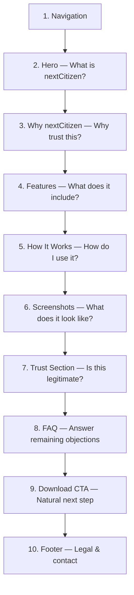
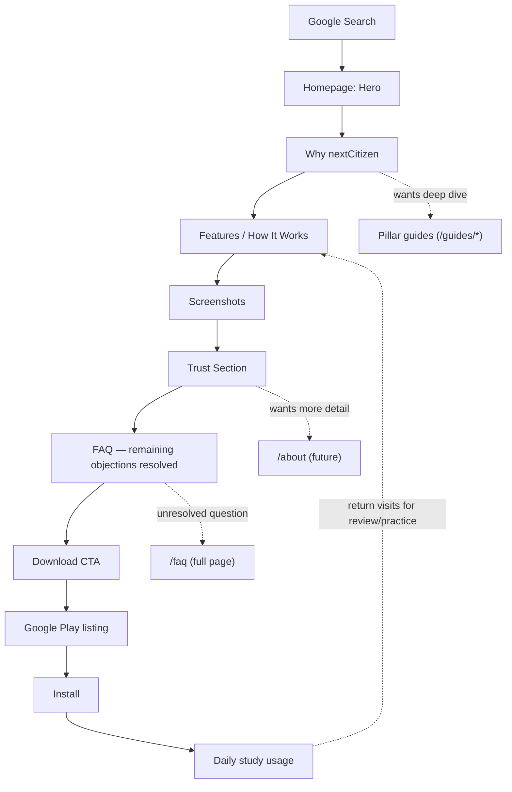

# nextCitizen Homepage Specification

**Company:** SanAkLabs
**Product:** nextCitizen
**Document type:** Product Requirements Document + UX Specification + Frontend Design Specification (combined)
**Document status:** Definitive homepage specification — guides implementation, is not itself an implementation
**References:** [`BRAND_GUIDELINES.md`](./BRAND_GUIDELINES.md) (design tokens, tone, visual rules) · [`CONTENT_STRATEGY.md`](./CONTENT_STRATEGY.md) (site architecture, pillar pages, FAQ/article roadmap, KPIs)

This document contains no homepage copy, no HTML, and no Astro code. It specifies *what each section must do, why it exists, and how it should be built*, so that implementation is unambiguous and cannot drift into a marketing-landing-page pattern.

---

## Purpose and Framing

The homepage is not a marketing landing page. It is the entry point to a long-term educational product website. Its job is to let a qualified, organically-arriving visitor answer their own question — "can I trust this, and will it actually help me?" — and arrive at "download the app" as their own conclusion, not a pushed decision.

**Primary business goal:** convert qualified organic visitors into Google Play installs, where the download happens because the visitor trusts the product, not because they were pressured.

**Visitors typically arrive already asking:**

- What is the USCIS Civics Test?
- How do I prepare?
- What study materials should I use?
- Is this app trustworthy?
- Does it actually help?
- Is it free?
- Where can I download it?

Every homepage section maps to one or more of these questions. No section exists that doesn't answer one of them.

**Design principles:** professional, helpful, simple, trustworthy, fast, accessible, modern, minimal.
**Explicitly avoided:** marketing hype, large walls of text, animation-heavy design, sales language.

**Content principle:** every section answers exactly one visitor question, has one clear purpose, and leads naturally into the next section. No filler sections.

---

## Homepage Composition (Overview)

Each section is specified below using a consistent 13-field template, followed by any section-specific detail the section requires.

---

## Section 1 — Navigation

| Field | Specification |
| --- | --- |
| **Purpose** | Orient the visitor immediately and provide a persistent, low-friction path to download without demanding a decision. |
| **User Question** | "Where am I, and how do I get around this site?" |
| **Business Goal** | Keep the download path always reachable without competing with the page's primary content. |
| **SEO Value** | Consistent site-wide internal linking structure (already implemented via `NavMenu.astro` + `routes.ts`); supports crawlability of core routes. |
| **Accessibility Notes** | Skip-to-content link (already implemented in `BaseLayout.astro`) must remain the first focusable element. Nav must be a `<nav aria-label="Primary">` landmark (already implemented). Current page indicated via `aria-current="page"` (already implemented). |
| **Content Guidelines** | Label text only — no taglines or marketing phrases in nav items. |
| **Visual Layout** | Logo/wordmark left-aligned, links right-aligned (desktop); logo + hamburger toggle (mobile). |
| **Primary CTA** | "Download" — present in nav, styled as a Secondary Button (per Brand Guidelines) so it doesn't visually compete with the Hero's Primary Button. |
| **Secondary CTA** | None — navigation should not carry more than one CTA. |
| **Success Criteria** | Visitors can reach any core page in one click/tap; nav does not obscure content on scroll on mobile. |
| **Recommended Components** | `Header.astro`, `NavMenu.astro` (both already implemented) plus a new `MobileNavToggle.astro`. |
| **Mobile Considerations** | Collapses to a hamburger-triggered menu; "Download" CTA remains visible even when the menu is collapsed. |
| **Desktop Considerations** | Full horizontal link list plus CTA, no collapse needed above the tablet breakpoint. |

**Navigation items:** Home, Features, FAQ, Blog, Download, Contact (matches the existing `primaryRoutes` data source — no new top-level items recommended for the homepage).

**Sticky or not:** Sticky (`position: sticky; top: 0`) is recommended. Rationale: the download CTA and core wayfinding should remain reachable during a long, content-rich scroll — consistent with "natural next step" conversion philosophy, not aggressive stickiness (no shrinking/expanding tricks, no shadow-heavy "scrolled" state).

**CTA placement:** Right-most nav item on desktop; persistent within the collapsed mobile header bar (not hidden inside the hamburger menu — a visitor should never need to open the menu to find the download link).

**Mobile navigation behavior:** Hamburger icon toggles a full-height overlay or slide-in panel; focus moves into the panel on open and returns to the toggle button on close (focus trap); `Escape` closes the panel. No animation beyond a simple fade/slide (see [Performance](#performance)).

**Implementation guidance:** Component `Header.astro` (exists, `src/components/layout/`) + `NavMenu.astro` (exists, `src/components/navigation/`) + new `MobileNavToggle.astro` (`src/components/navigation/`). Reusability: site-wide, used in `BaseLayout.astro`. Props: none required beyond current route-derived active-state logic. Future extension: a "current section" indicator when in-page anchor scrolling is added to the homepage.

---

## Section 2 — Hero

| Field | Specification |
| --- | --- |
| **Purpose** | Answer "What is nextCitizen?" within the first few seconds, and establish trust immediately — before any feature detail. |
| **User Question** | "What is this, and is it for me?" |
| **Business Goal** | Qualify the visitor instantly (right product, right audience) and present a single clear next action. |
| **SEO Value** | Contains the page's `<h1>`, which should reflect the core query intent ("U.S. Citizenship Test preparation") in plain language — see [SEO Strategy](#seo-strategy). |
| **Accessibility Notes** | `<h1>` lives here and only here on the page. Hero image/illustration is decorative or supportive, not load-bearing for meaning — must not be the sole carrier of information. |
| **Content Guidelines** | State plainly what the product is and who it's for. No superlatives ("best," "#1," "guaranteed"). Subheadline should acknowledge the user's actual situation (preparing for the civics test/interview), not sell the product. |
| **Visual Layout** | Two-column on desktop (copy left, illustration right); single stacked column on mobile (copy first, illustration second — never illustration before the `<h1>`). |
| **Primary CTA** | Download the app — the single primary action of the entire page. |
| **Secondary CTA** | "Learn how it works" (anchor-scrolls to Section 5) or "See Features" — a low-commitment alternative for visitors not ready to decide. |
| **Success Criteria** | Visitor can state, in their own words, what the product does after reading only the Hero. Largest Contentful Paint (LCP) element renders quickly (see [Performance](#performance)). |
| **Recommended Components** | New `Hero.astro`. |
| **Mobile Considerations** | Illustration is de-emphasized in size relative to copy; CTA buttons are full-width or near-full-width for easy tapping. |
| **Desktop Considerations** | Illustration may be larger and more detailed; CTA buttons remain a fixed comfortable width (not full-bleed). |

**Headline strategy:** state what the product *is* in plain, literal language (product category + audience), not a clever tagline. Avoid metaphor that requires cultural/idiomatic fluency to parse, given the ESL-heavy audience (per Brand Guidelines).

**Subheadline strategy:** one sentence that acknowledges the visitor's actual situation (studying for the civics test/interview) and states the product's core mechanism (guided study, practice, confidence-building) — not a list of features.

**Illustration strategy:** minimal, modern, professional illustration per Brand Guidelines subject list (person studying, mobile phone, subtle flag accent). No stock-photo clutter, no busy scene. The illustration supports the emotional tone (calm, capable) rather than explaining the product mechanically — mechanics belong in Features/How It Works.

**Image placement:** right of copy on desktop, below copy on mobile; always below or beside the `<h1>`, never above it in DOM/visual order (accessibility + LCP reasons).

**Implementation guidance:** Component `Hero.astro` (`src/components/home/`, new folder). Reusability: homepage-only (not designed for reuse, unlike layout/navigation/seo/ui components). Props: `headline`, `subheadline`, `primaryCtaHref`, `secondaryCtaHref` (kept as props even though homepage-only, so copy changes don't require touching layout logic). Future extension: A/B-testable headline variants once analytics are in place.

---

## Section 3 — Why nextCitizen

| Field | Specification |
| --- | --- |
| **Purpose** | Answer "Why should I trust this instead of another app?" with concrete, falsifiable reasons rather than sentiment. |
| **User Question** | "What makes this different/better for me, specifically?" |
| **Business Goal** | Differentiate on trust and pedagogy rather than price or feature count, consistent with brand positioning as "a knowledgeable coach." |
| **SEO Value** | Natural place for `<h2>` phrasing that mirrors comparison-intent queries (e.g., "study method," "official questions," "trusted resource") without keyword stuffing. |
| **Accessibility Notes** | Use a genuine list structure (`<ul>`/`<ol>` or a semantically grouped set of `<article>`/`<section>` elements) rather than styled `
`s, so assistive tech announces it as a list of distinct points. |
| **Content Guidelines** | Each value proposition must be a verifiable fact or mechanism (e.g., "based on official USCIS questions"), never a vague superlative. No more than 3–4 items — more than that dilutes into a feature list (which belongs in Section 4). |
| **Visual Layout** | Simple grid (3–4 columns desktop, single column mobile), icon + short heading + one supporting sentence per item — no long paragraphs. |
| **Primary CTA** | None — this section's job is persuasion through explanation, not conversion. |
| **Secondary CTA** | Optional soft link to the relevant pillar guide or `/faq` if a value prop naturally invites more detail (e.g., "See our methodology" → future `/about`). |
| **Success Criteria** | Visitor can name at least one concrete, specific reason to trust the product after reading this section (measurable via qualitative user testing, not analytics). |
| **Recommended Components** | New `WhyNextCitizen.astro`, composed of a repeated `ValueProposition.astro` item. |
| **Mobile Considerations** | Single column, generous vertical spacing between items so they read as distinct points, not a wall of text. |
| **Desktop Considerations** | 3–4 column grid; equal-height cards without needing forced equal-length copy (avoid awkward padding to force alignment). |

**Recommended value propositions (structure, not final copy):**

1. **Sourced from official material** — questions and content are grounded in official USCIS civics content, not invented or crowd-sourced trivia.
2. **Built for real study habits** — designed around how people actually study in short sessions (commute, breaks), not a one-time cram tool.
3. **Plain-English, ESL-aware design** — content and interface designed for readers who may be studying in a second language.
4. *(Optional 4th)* **Kept current** — content is reviewed and updated when USCIS updates the test, addressed transparently rather than silently.

Each must be independently true and independently checkable — no proposition should depend on unverifiable claims like user counts or ratings (per Brand Guidelines' no-fake-data rule).

**Implementation guidance:** Component `WhyNextCitizen.astro` (`src/components/home/`) + `ValueProposition.astro` (`src/components/ui/`, reusable — this card pattern is generic enough to reuse in Features or Trust sections). Props for `ValueProposition`: `icon`, `title`, `description`. Future extension: link each value prop to supporting evidence (e.g., a future `/about` methodology page).

---

## Section 4 — Features

| Field | Specification |
| --- | --- |
| **Purpose** | Answer "What does the app actually include?" concretely enough that a visitor can picture using it. |
| **User Question** | "What can I actually do in this app?" |
| **Business Goal** | Build confidence that the app is a complete, capable tool — supporting the download decision with specifics, not adjectives. |
| **SEO Value** | Feature names/descriptions naturally absorb feature-related long-tail queries (e.g., "flashcards for citizenship test," "practice interview questions"). |
| **Accessibility Notes** | Each feature card is a labeled group (heading + description); icons are decorative (`aria-hidden="true"`) with the text label carrying the meaning, never the icon alone. |
| **Content Guidelines** | Describe what the feature *does for the user*, not just its name (e.g., not just "Flashcards" but what studying with them accomplishes). Group related features together rather than listing them flatly. |
| **Visual Layout** | Card grid, per Brand Guidelines (16px radius, light shadow, generous padding). |
| **Primary CTA** | None required — but the section may close with a single soft link to `/features` for visitors who want more depth. |
| **Secondary CTA** | Link to `/features` (the dedicated route) framed as "See all features," positioned after the grid, not interrupting it. |
| **Success Criteria** | Visitor can describe at least two concrete things they'd do in the app after reading this section. |
| **Recommended Components** | New `FeatureGrid.astro` composed of `FeatureCard.astro`. |
| **Mobile Considerations** | Single column or 2-column card grid; icons and headings remain legible at small sizes. |
| **Desktop Considerations** | 3-column grid typical; avoid more than 6 cards on the homepage (deeper detail belongs on `/features`). |

**Recommended feature groupings** (categories, not final copy): *Study* (flashcards, official question bank), *Practice* (mock interview / quiz mode), *Track Progress* (review weak areas), *Prepare for the Interview* (interview-specific content). Homepage shows one representative feature per group (max ~4–6 cards); `/features` covers the full depth.

**Implementation guidance:** Component `FeatureGrid.astro` (`src/components/home/`) + `FeatureCard.astro` (`src/components/ui/`, reusable across homepage and `/features`). Props for `FeatureCard`: `icon`, `title`, `description`, `href?` (optional link to relevant `/features` anchor). Future extension: highlight a "new" badge for recently shipped features once the app has a release cadence.

---

## Section 5 — How It Works

| Field | Specification |
| --- | --- |
| **Purpose** | Answer "How do I actually use this, step by step?" — translate features into a journey. |
| **User Question** | "What does a study session/journey with this app actually look like?" |
| **Business Goal** | Reduce perceived effort/complexity, a common silent objection to installing a new study tool. |
| **SEO Value** | Step labels can mirror the natural study journey terminology used in search queries ("study," "practice," "review," "interview prep"). |
| **Accessibility Notes** | Use an ordered list (`<ol>`) semantically, even if visually presented as numbered cards or a horizontal stepper — order is meaningful content, not just decoration. |
| **Content Guidelines** | Exactly as many steps as are true — do not pad to a "nicer" number. Each step is one short sentence, not a paragraph. |
| **Visual Layout** | Horizontal stepper with connecting line on desktop; vertical stacked steps on mobile. |
| **Primary CTA** | None. |
| **Secondary CTA** | None required — this section's job is comprehension, not conversion; a CTA here would interrupt the explanation. |
| **Success Criteria** | Visitor can restate the journey (e.g., "study, then practice, then review, then prepare for the interview") unaided after reading. |
| **Recommended Components** | New `HowItWorks.astro` composed of `StepItem.astro`. |
| **Mobile Considerations** | Vertical layout with a connecting line/number badge; avoid horizontal scroll on small screens. |
| **Desktop Considerations** | Horizontal stepper works well given more width; keep to 3–5 steps to avoid crowding. |

**Recommended journey steps (structure, not final copy):** Study → Practice → Review → Prepare for the Interview. Four steps is the recommended maximum; fewer is acceptable, more risks diluting clarity.

**Implementation guidance:** Component `HowItWorks.astro` (`src/components/home/`) + `StepItem.astro` (`src/components/ui/`). Props for `StepItem`: `stepNumber`, `title`, `description`, `icon?`. Future extension: link each step to its corresponding feature/blog cluster (e.g., "Review" step links to Study Tips category).

---

## Section 6 — Screenshots

| Field | Specification |
| --- | --- |
| **Purpose** | Answer "What does it actually look like?" — reduce uncertainty and signal that this is a real, polished, existing product. |
| **User Question** | "Does this look legitimate and easy to use?" |
| **Business Goal** | Build confidence and reduce the perceived risk of installing an unfamiliar app. |
| **SEO Value** | Low direct SEO value; primary value is trust/conversion. Ensure images don't harm page performance (see [Performance](#performance)). |
| **Accessibility Notes** | Every screenshot needs descriptive alt text describing what's shown and its purpose (e.g., "Flashcard screen showing an official civics question and answer"), never generic ("screenshot 1"). |
| **Content Guidelines** | Captions describe function, not marketing praise (e.g., "Practice with official questions," not "Beautiful, powerful flashcards!"). |
| **Visual Layout** | Static grid or simple horizontal scroll of phone-frame mockups — no auto-playing carousel. |
| **Primary CTA** | None. |
| **Secondary CTA** | None — this section supports the decision, it doesn't ask for it. |
| **Success Criteria** | Visitor can identify at least one concrete screen/feature by name after viewing. |
| **Recommended Components** | New `ScreenshotGallery.astro` composed of `PhoneMockup.astro`. |
| **Mobile Considerations** | Horizontal scroll-snap gallery (native CSS `scroll-snap`, no JS carousel library) to conserve vertical space. |
| **Desktop Considerations** | Static grid (e.g., 3–4 across) — no need for scrolling if width allows. |

**Number of screenshots:** 3–4 is recommended. Enough to show the core journey (study, practice, review/interview-prep screen) without becoming a marketing gallery.

**Phone mockups:** simple, modern device frame (per Brand Guidelines' "minimal, modern, professional" illustration rule) — avoid ornate or dated device bezel styles.

**Captions:** one short, functional sentence per screenshot, matching the "How It Works" step it corresponds to.

**Best ordering:** mirror the Section 5 journey order (Study → Practice → Review/Interview Prep), so Screenshots visually reinforces How It Works rather than introducing a new structure.

**Accessibility guidance:** descriptive alt text per image (see above); if implemented as a scroll-snap gallery, ensure it's reachable and operable via keyboard (arrow keys or tab-through), and that scroll position doesn't trap focus.

**Implementation guidance:** Component `ScreenshotGallery.astro` (`src/components/home/`) + `PhoneMockup.astro` (`src/components/ui/`, reusable for `/features` or future app-store-style pages). Props for `PhoneMockup`: `src`, `alt`, `caption`. Images should be pre-optimized WebP with explicit `width`/`height` to prevent layout shift.

---

## Section 7 — Trust Section

This section is the credibility backbone of the homepage — for this audience, trust signals matter as much as feature claims.

| Field | Specification |
| --- | --- |
| **Purpose** | Answer "Is this legitimate, safe, and honest?" directly and explicitly, rather than hoping trust is inferred. |
| **User Question** | "Can I trust this with something as important as my citizenship preparation?" |
| **Business Goal** | Remove the single biggest silent objection to installing an unfamiliar app for a high-stakes life event. |
| **SEO Value** | Strong candidate for `Organization`/`AboutPage`-adjacent structured data once linked to a future `/about` page; reinforces E-E-A-T signals Google increasingly weighs for YMYL-adjacent content. |
| **Accessibility Notes** | Present as clearly labeled, distinct statements (heading + short paragraph each), not a dense trust-badge wall of logos/icons. |
| **Content Guidelines** | Every claim must be independently true and checkable. No fabricated review counts, no invented user testimonials, no vague "trusted by thousands" language (per Brand Guidelines). |
| **Visual Layout** | Simple 2×2 or single-column list of labeled statements, calmer/plainer visual treatment than Features (this section should feel like a statement of fact, not a sales pitch). |
| **Primary CTA** | None. |
| **Secondary CTA** | Link to `/privacy` and/or future `/about` for visitors who want the full detail. |
| **Success Criteria** | Visitor can state, unaided, at least one specific reason the product is trustworthy (not just "it seemed fine"). |
| **Recommended Components** | New `TrustSection.astro`, reusing `ValueProposition.astro` from Section 3 for visual consistency. |
| **Mobile Considerations** | Single column, one statement per row, clear separation (border or spacing) between items. |
| **Desktop Considerations** | 2×2 grid acceptable; avoid stretching to a wide single row that feels like a badge strip. |

**Recommended credibility elements (per Content Strategy's Trust Building Strategy):**

1. **Educational methodology** — a plain statement that content is grounded in official USCIS material and how it's kept current.
2. **Independent product disclaimer** — explicit, unambiguous statement that nextCitizen is not affiliated with USCIS or the U.S. government (this is both a trust and a legal-clarity signal).
3. **Regular updates** — a statement (with a real, verifiable freshness signal, e.g., last content review date) that the product is actively maintained.
4. **Privacy commitment** — a one-sentence, plain-English summary linking to the full `/privacy` page.
5. *(Optional 5th if needed)* **Accessibility commitment** — a short statement linking to Brand Guidelines' accessibility standard, signaling the product is built to be usable by everyone.

**Implementation guidance:** Component `TrustSection.astro` (`src/components/home/`). Props: reuses `ValueProposition` prop shape (`icon`, `title`, `description`, plus optional `href` for the disclaimer/privacy links). Future extension: once `/about` exists, link the methodology statement directly to it.

---

## Section 8 — FAQ

| Field | Specification |
| --- | --- |
| **Purpose** | Resolve remaining, specific objections right before the download decision — the last thing standing between trust and action. |
| **User Question** | "What about my specific remaining doubts (cost, offline use, accuracy, effort)?" |
| **Business Goal** | Prevent last-minute drop-off by answering the most conversion-relevant questions in place, without requiring a page navigation. |
| **SEO Value** | Strong candidate for `FAQPage` structured data (only if every displayed answer is genuinely present in the markup, not hidden client-side-only text — see [SEO Strategy](#seo-strategy)). |
| **Accessibility Notes** | Implement as native disclosure elements (`
`/`
`) or an accordion with correct `aria-expanded`/`aria-controls` if custom-built; each question is a real heading, not just bold text. |
| **Content Guidelines** | Short, direct answers (2–4 sentences). No answer should require reading the whole homepage to make sense in isolation. |
| **Visual Layout** | Accordion (collapsed by default) grouped under 2–3 category labels, to keep the section from feeling like a long list. |
| **Primary CTA** | None within the FAQ items themselves. |
| **Secondary CTA** | "See all FAQs" link to `/faq` at the end of the section, for visitors with questions beyond this curated subset. |
| **Success Criteria** | The visitor's specific remaining objection (cost, effort, trust, accuracy) is answered without needing to leave the homepage. |
| **Recommended Components** | New `FaqAccordion.astro` composed of `FaqItem.astro`. |
| **Mobile Considerations** | Full-width accordion items, generous tap targets on the question row (44px minimum height). |
| **Desktop Considerations** | Can constrain to a comfortable reading width (per Brand Guidelines' container width) rather than stretching full-bleed. |

**Recommended FAQ topics (10–12), grouped by category:**

*Trust & Legitimacy*
1. Is nextCitizen affiliated with USCIS or the U.S. government?
2. Is my data/privacy protected?
3. Is the content accurate and up to date?

*Cost & Access*
4. Is nextCitizen free?
5. Do I need an internet connection to use it?

*Product Fit*
6. Is this different from just using flashcards or a PDF?
7. Can family members use it to help me study?
8. Is it useful for the reading and writing tests too, or just civics?

*Getting Started*
9. How do I download nextCitizen?
10. What devices/Android versions are supported?
11. How long does it take to see results?
12. *(Optional)* Is there a study plan, or do I just study randomly?

**Why these belong on the homepage instead of only the dedicated `/faq` page:** the homepage FAQ is a deliberately small, curated subset — specifically the questions most likely to be the *last objection* before a download decision (trust, cost, fit). The dedicated `/faq` route (per Content Strategy) is the exhaustive, SEO-oriented resource covering the full breadth of informational queries. Duplicating the full FAQ list here would create both a wall-of-text problem and duplicate-content risk; instead, the homepage subset should link out to `/faq` for anything beyond these ~10–12 conversion-critical questions.

**Implementation guidance:** Component `FaqAccordion.astro` (`src/components/home/`, but built generically enough to be reused on `/faq` itself) + `FaqItem.astro` (`src/components/ui/`). Props for `FaqItem`: `question`, `answer`, `id` (for `aria-controls`). Future extension: share the same FAQ data source between the homepage subset and the full `/faq` page to avoid content drift.

---

## Section 9 — Download CTA

| Field | Specification |
| --- | --- |
| **Purpose** | Provide one clear, low-pressure final action once trust and understanding have already been established. |
| **User Question** | "Okay, I'm convinced — where do I actually get this?" |
| **Business Goal** | Convert. This is the section explicitly optimized for the install action — everything above it is optimized for trust and understanding. |
| **SEO Value** | Internal link to `/download` (the canonical conversion route) and outbound to the Play Store listing. |
| **Accessibility Notes** | Button has clear, descriptive accessible text (not just a Play Store badge image with no text alternative — badge image must include `alt="Get it on Google Play"` or equivalent). |
| **Content Guidelines** | Calm, plain, low-pressure language. No urgency/scarcity tactics ("limited time," "don't miss out") — inconsistent with brand tone and inappropriate for this subject matter. |
| **Visual Layout** | Centered, generously spaced, visually distinct section (e.g., subtle background tint per Brand Guidelines' `--color-bg-subtle`) so it reads as a clear closing moment, not another content block. |
| **Primary CTA** | Google Play badge/button — the single action of this section. |
| **Secondary CTA** | None — a second CTA here would dilute the one action this section exists for. |
| **Success Criteria** | Click-through rate to the Play Store listing from this section (see [Success Metrics](#success-metrics)). |
| **Recommended Components** | New `DownloadCta.astro`. |
| **Mobile Considerations** | Full-width or near-full-width button, positioned within easy thumb reach. |
| **Desktop Considerations** | Centered, fixed-width button — avoid stretching a button across a wide desktop viewport. |

**Headline:** should restate the core promise in one plain sentence — not a new claim, a calm closing of the argument already made above.

**Supporting copy:** one sentence acknowledging it's free/simple to start (if true), removing any remaining friction perception.

**Button placement:** single, centered, high-contrast (per Brand Guidelines Primary Button spec) — the only Primary Button styling used twice on the page (Hero and here), reinforcing it as *the* action.

**Trust indicators:** repeat one already-established trust signal near the button (e.g., "Not affiliated with USCIS — an independent study tool" or a link to Privacy) so the final decision point doesn't feel like a bare sales pitch.

**Implementation guidance:** Component `DownloadCta.astro` (`src/components/home/`, but generic enough to reuse on `/download` and potentially end of blog articles per Content Strategy's Download Strategy). Props: `headline`, `supportingCopy`, `playStoreHref`, `trustNote?`. Future extension: swap Play Store badge for a dual App Store/Play Store layout if iOS ships later.

---

## Section 10 — Footer

| Field | Specification |
| --- | --- |
| **Purpose** | Provide legal/trust infrastructure and a secondary, low-emphasis path to every core route. |
| **User Question** | "How do I contact them, and what are the legal/privacy terms?" |
| **Business Goal** | Reinforce legitimacy (a real, accountable company) without asking for anything. |
| **SEO Value** | Secondary internal linking surface — should not duplicate primary nav 1:1, but include legal/trust routes not present in primary nav. |
| **Accessibility Notes** | Footer is a `<footer>` landmark (already implemented); legal links are a labeled `<nav aria-label="Legal">` (already implemented). |
| **Content Guidelines** | Plain, factual, no marketing language of any kind — the footer is infrastructure, not a pitch. |
| **Visual Layout** | Already implemented (`Footer.astro`): copyright + legal nav, calm/subtle background per Brand Guidelines. |
| **Primary CTA** | None — footers should not carry a competing CTA. |
| **Secondary CTA** | None. |
| **Success Criteria** | Every legal/trust route is reachable from any page without needing to return to the homepage. |
| **Recommended Components** | `Footer.astro` (already implemented). |
| **Mobile Considerations** | Stacks vertically if needed (already handled via flex-wrap in existing implementation). |
| **Desktop Considerations** | Single row, space-between layout (already implemented). |

**Links:** Privacy, Disclaimer, Contact, and (recommended addition per Content Strategy) About, once that route exists.
**Legal:** Privacy Policy and Disclaimer must be present and prominent — not buried below unrelated links.
**Contact:** direct link to `/contact`, described earlier in Content Strategy as disproportionately important trust infrastructure for this audience.
**Copyright:** company name + current year (already implemented dynamically in `Footer.astro`).

No new footer component work is required for the homepage; this section documents the existing implementation's role in the homepage's overall trust architecture rather than proposing changes (per this document's "no code changes" constraint).

---

## User Journey

The journey is designed so that a visitor can exit to a deeper resource (`/faq`, `/about`, a pillar guide) at almost any point without being "lost" — each of those destinations should itself route back toward Download once its own question is answered, per the Content Strategy's internal linking model.

---

## SEO Strategy

| Element | Recommendation |
| --- | --- |
| **Homepage title (pattern)** | `{Product name} — {Plain-language description of what it does} \| {Company}`, e.g. a structure such as *"nextCitizen — Prepare for the U.S. Citizenship Test \| SanAkLabs"*. Final wording is a content-writing task, not this spec's job — the pattern is what matters: product name, plain description, company. |
| **Meta description (pattern)** | 150–160 characters, answer-first: state plainly what the product helps with and for whom, no hype adjectives. Follows the same guidance as `CONTENT_STRATEGY.md`'s meta description rules. |
| **Canonical URL** | Self-referencing canonical to the homepage's base-aware URL — already implemented via `canonicalUrl('/')` in the existing `Seo.astro`/`BaseLayout.astro`. No change needed. |
| **Internal links** | Homepage must link to: all four pillar guides (`/guides/*`), `/features`, `/faq`, `/download`, `/contact`, and — once built — `/about`. Per Content Strategy, pillar links carry more topical authority value than a generic `/blog` link and should be prioritized in the Why/Features/Trust sections rather than only in navigation. |
| **Schema recommendations** | `Organization` (name, logo, sameAs if social profiles exist) site-wide; `FAQPage` scoped to the Section 8 FAQ items **only if** those Q&As are rendered as real, crawlable markup (not client-side-only); `SoftwareApplication` only once real, verifiable app metadata (rating, install count) exists — do not add placeholder/fabricated values now. |
| **Heading hierarchy** | One `<h1>` in the Hero. Each subsequent section uses one `<h2>` (Why nextCitizen, Features, How It Works, Screenshots, Trust, FAQ, Download). Individual feature/step/FAQ items use `<h3>` within their section. No heading level is skipped. |
| **Image alt text strategy** | Hero illustration: describe its supportive meaning briefly (or mark decorative with empty `alt` if it adds no independent information). Screenshots: describe the specific screen and its function (see Section 6). Icons: `aria-hidden="true"` when paired with visible text; described alt text only if they carry unique meaning alone. |

---

## Conversion Strategy

**Why each CTA exists:**

| CTA | Section | Why it exists |
| --- | --- | --- |
| Nav "Download" | Navigation | Always-available path for visitors who already know they want the app — should not be the primary conversion driver, just a safety net. |
| Hero primary CTA | Hero | Captures visitors who arrive already convinced (e.g., from a branded search or a referral) without making them scroll through the whole page. |
| Hero secondary CTA | Hero | Gives undecided visitors a graceful next step ("learn more") instead of bouncing. |
| Features "See all features" | Features | Low-commitment path to depth for visitors who want more before deciding. |
| FAQ "See all FAQs" | FAQ | Escape valve for visitors whose specific objection isn't in the curated subset. |
| Download CTA button | Download CTA | The primary, fully-earned conversion moment — appears only after trust, features, and objections have already been addressed. |

**Where CTAs should appear:** Navigation (persistent, low-emphasis), Hero (primary decision point for already-convinced visitors), Download CTA section (primary decision point for visitors who needed the full page to decide).

**Where CTAs should NOT appear:** Why nextCitizen, Features (beyond one soft "see more" link), How It Works, Screenshots, Trust Section, and within individual FAQ answers. These sections exist to build understanding and trust — inserting a download ask mid-explanation undercuts the "conclusion the visitor reaches themselves" principle and reads as pressure.

**How trust is built before asking for the download:** the section order itself *is* the trust-building sequence — Hero (clarity) → Why (differentiation) → Features/How It Works (concrete capability) → Screenshots (proof it's real) → Trust Section (explicit credibility statements) → FAQ (objection handling) → *then* Download CTA. No section before the Download CTA asks for anything; every section before it only gives.

---

## Accessibility

| Area | Recommendation |
| --- | --- |
| **Keyboard navigation** | Every interactive element (nav links, mobile toggle, accordion FAQ items, CTA buttons, screenshot gallery if scrollable) must be reachable and operable via `Tab`/`Shift+Tab`/`Enter`/`Space` alone, in the same order as the visual/DOM layout. |
| **ARIA usage** | Use ARIA only where native semantics fall short: `aria-expanded`/`aria-controls` on FAQ accordion triggers, `aria-current="page"` on active nav link (already implemented), `aria-hidden="true"` on decorative icons. Prefer native elements (`
`, `<button>`, `<nav>`) over ARIA-heavy custom widgets wherever possible. |
| **Heading hierarchy** | Single `<h1>` (Hero) → one `<h2>` per section → `<h3>` for items within a section. No skipped levels, no headings chosen purely for visual size. |
| **Screen reader considerations** | Skip-to-content link (already implemented) must land on the Hero's main content. Each section should be a landmark or clearly labeled region (`<section aria-labelledby="...">` referencing its own heading id) so screen reader users can navigate section-by-section. |
| **Focus order** | Must follow document order: Nav → Hero → Why → Features → How It Works → Screenshots → Trust → FAQ → Download CTA → Footer. No use of `tabindex` values greater than 0 to reorder focus. |
| **Color contrast** | All text/background pairings must meet WCAG AA (4.5:1 body, 3:1 large text) using the existing Brand Guidelines palette — verify Gold-on-white and Secondary-Text-on-Background combinations specifically, as flagged in Brand Guidelines. |
| **Reduced motion** | All transitions (hover elevation, accordion open/close, mobile nav open/close, scroll-snap gallery) must respect `prefers-reduced-motion` and fall back to instant state changes — consistent with the global CSS rule already implemented in `global.css`. |

---

## Responsive Design

| Section | Mobile | Tablet | Desktop |
| --- | --- | --- | --- |
| Navigation | Collapsed hamburger + persistent Download CTA | Collapsed or partially expanded depending on link count | Fully expanded horizontal nav |
| Hero | Stacked: copy, then illustration; full-width CTA buttons | Similar to mobile with more breathing room | Two-column: copy left, illustration right |
| Why nextCitizen | Single column list | 2-column grid | 3–4 column grid |
| Features | 1-column or 2-column cards | 2-column cards | 3-column cards, max ~6 shown |
| How It Works | Vertical stacked steps | Vertical or compact horizontal | Horizontal stepper with connecting line |
| Screenshots | Horizontal scroll-snap gallery | Horizontal scroll or 2-column grid | Static 3–4 column grid |
| Trust Section | Single column, one statement per row | 2-column grid | 2×2 grid |
| FAQ | Full-width accordion, large tap targets | Full-width accordion, constrained max-width | Constrained max-width (per container width token) |
| Download CTA | Full-width button, centered copy | Centered, moderate width | Centered, fixed comfortable width |
| Footer | Stacked links | Stacked or single row depending on link count | Single row, space-between |

All breakpoints should reuse the container width and spacing tokens already defined in `global.css` (see [Design Tokens](#design-tokens)) rather than introducing new breakpoint-specific values.

---

## Performance

| Area | Recommendation |
| --- | --- |
| **Image strategy** | WebP format for all raster images (Hero illustration if raster, Screenshots); SVG for icons and simple illustrations where possible (smaller, scales cleanly). Explicit `width`/`height` on every image to prevent layout shift. |
| **Lazy loading** | Hero image loads eagerly (it's likely the LCP element); Screenshots and any below-the-fold imagery use native `loading="lazy"`. |
| **Bundle size** | Homepage should ship with zero required client-side JavaScript framework. FAQ accordion should use native `
`/`
` if visual requirements allow, or a small vanilla script only if custom styling requires it — no component framework or heavy accordion library. |
| **Animation limits** | Only fade/slide/subtle-hover transitions, per Brand Guidelines. No parallax, no scroll-triggered animation libraries, no auto-playing carousels. |
| **Lighthouse targets** | 90+ across Performance, Accessibility, Best Practices, and SEO, consistent with the site-wide performance principle already established in Brand Guidelines and the Phase 1 technical build. |

---

## Design Tokens

This specification does not redefine any color, typography, spacing, or radius value — all of it is already defined in [`BRAND_GUIDELINES.md`](./BRAND_GUIDELINES.md) and implemented as CSS custom properties in `src/styles/global.css`. Homepage-specific guidance is limited to *how* those existing tokens should be applied:

| Token category | Homepage application |
| --- | --- |
| **Color** | Navy (`--color-primary`) for the Hero/Download primary buttons and any single "this is the one action" element. American Red reserved only for a genuine urgent/notification use — none is anticipated on the homepage; do not introduce a red CTA here. Gold reserved for an achievement/success moment if one naturally exists (none is required on the homepage). Background/Card tokens (`--color-bg`, `--color-bg-subtle`, `--color-bg` alternation) should be used to visually separate sections (e.g., Trust Section or Download CTA on `--color-bg-subtle`) without introducing new colors. |
| **Typography** | Existing type scale tokens (`--font-size-3xl` for the Hero `<h1>` down to `--font-size-sm` for captions/helper text) should be applied consistently — no homepage-specific font sizes. |
| **Spacing** | Section-to-section vertical rhythm should use the larger tokens already defined (`--space-2xl`/`--space-3xl`), while in-section spacing uses the smaller tokens (`--space-sm`/`--space-md`) — this is the existing `.page-hero`/`.placeholder-section` pattern from Phase 1, extended to the new homepage sections. |
| **Radius** | Cards (Features, Trust, FAQ items if card-styled) use `--radius-lg` (16px) per Brand Guidelines; buttons use the documented 12px pattern. |
| **Container width** | All sections respect the existing `--container-width` (72rem / effectively the "max 1200px" principle from Brand Guidelines) — no section should introduce a wider or narrower content measure without reason. |

---

## Implementation Guidance Summary

| Section | Component(s) | Suggested folder | Reusable? | Key props |
| --- | --- | --- | --- | --- |
| Navigation | `Header.astro`, `NavMenu.astro` (exist), `MobileNavToggle.astro` (new) | `src/components/layout/`, `src/components/navigation/` | Site-wide | — |
| Hero | `Hero.astro` (new) | `src/components/home/` | Homepage-only | `headline`, `subheadline`, `primaryCtaHref`, `secondaryCtaHref` |
| Why nextCitizen | `WhyNextCitizen.astro` (new), `ValueProposition.astro` (new, shared) | `src/components/home/`, `src/components/ui/` | `ValueProposition` reusable in Trust Section | `icon`, `title`, `description` |
| Features | `FeatureGrid.astro` (new), `FeatureCard.astro` (new, shared) | `src/components/home/`, `src/components/ui/` | `FeatureCard` reusable on `/features` | `icon`, `title`, `description`, `href?` |
| How It Works | `HowItWorks.astro` (new), `StepItem.astro` (new) | `src/components/home/`, `src/components/ui/` | Homepage-only initially | `stepNumber`, `title`, `description`, `icon?` |
| Screenshots | `ScreenshotGallery.astro` (new), `PhoneMockup.astro` (new) | `src/components/home/`, `src/components/ui/` | `PhoneMockup` reusable on `/features` or `/download` | `src`, `alt`, `caption` |
| Trust Section | `TrustSection.astro` (new) | `src/components/home/` | Reuses `ValueProposition` | Same as `ValueProposition`, plus optional `href` |
| FAQ | `FaqAccordion.astro` (new), `FaqItem.astro` (new) | `src/components/home/`, `src/components/ui/` | Reusable on full `/faq` page | `question`, `answer`, `id` |
| Download CTA | `DownloadCta.astro` (new) | `src/components/home/` | Reusable on `/download` and blog article endings | `headline`, `supportingCopy`, `playStoreHref`, `trustNote?` |
| Footer | `Footer.astro` (exists) | `src/components/layout/` | Site-wide | — |

**Folder convention rationale:** a new `src/components/home/` folder isolates homepage-composition components (which orchestrate layout and content for a specific page) from `src/components/ui/` (generic, reusable presentational pieces also usable on `/features`, `/faq`, `/download`), consistent with the separation already established between `components/layout`, `components/navigation`, `components/seo`, and `components/ui` in Phase 1.

---

## Success Metrics

| KPI | What it measures | Measurement approach |
| --- | --- | --- |
| **Bounce rate** | Whether the Hero/Why sections successfully qualify and retain visitors | GA4 engaged-session rate on `/` |
| **Scroll depth** | How far visitors actually read before deciding (or leaving) | GA4 scroll-tracking events at 25/50/75/100% |
| **CTA click rate** | Effectiveness of each individual CTA (nav, hero primary/secondary, download) | GA4 custom events per CTA, named distinctly (e.g., `cta_click_hero_primary`, `cta_click_nav_download`) |
| **Play Store click rate** | Whether the Download CTA section itself converts intent into action | GA4 event on outbound Play Store link click |
| **Install conversion** | Whether homepage traffic actually results in installs | Play Console acquisition report cross-referenced with UTM-tagged homepage download links |
| **Organic traffic to `/`** | Overall top-of-funnel health | Google Search Console + GA4 |
| **Section-level engagement** | Which sections are actually being read vs. skipped | Scroll-depth-by-section or per-section visibility events, used to identify underperforming sections for revision |

Per Content Strategy's KPI philosophy, these should be reviewed together, not in isolation — e.g., high scroll depth but low CTA click rate suggests the Trust/FAQ sections aren't resolving objections; high bounce rate suggests the Hero is failing to qualify visitors correctly.

---

This specification is part of the SanAkLabs Product, UX, and Engineering Standards.
